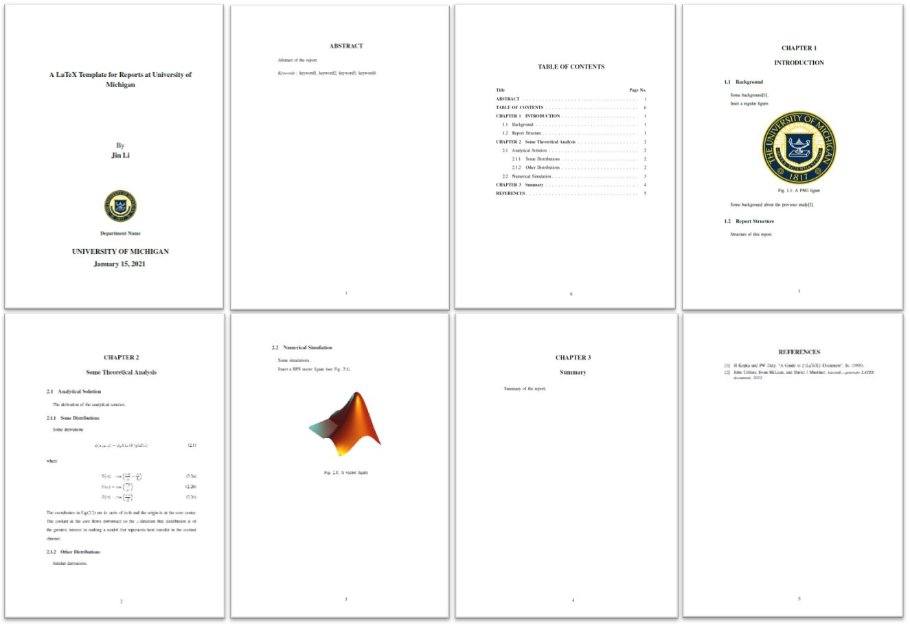
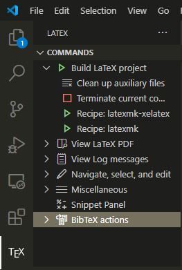

# LaTeX Template for Reports at University of Michigan

This template is adapted from [NIT - Trichy B.Tech Thesis Template](https://www.overleaf.com/latex/templates/nit-trichy-btech-thesis-template/cywtdmqjjmgr)
on Overleaf.

Here is an overview of the template:
<<<<<<< HEAD

=======

>>>>>>> b9bcbeb472e25581d18123a5d594e3c9ae642efc

## Dependency

    - TeX Live
    - vscode with LaTeX Workshop extension (optional)
    - Linux (optional)

## Usage

1. All the contents of the report are included in [*main.tex*](main.tex). Replace anything you need in the *.tex* files, *.bib* files and figures in the *fig* directory.
   
    ```
    |-- main.tex
        |-- titlepage.tex
        |-- abstract.tex
        |-- Chapter1.tex
        |-- Chapter2.tex
        |-- Chapter3.tex
        |-- summary.tex
        |-- reference.bib
    ```

2. There are two ways to compile the full report.
    
    1. Use Linux command ["make"](https://www.gnu.org/software/make/#:~:text=Make%20is%20not%20limited%20to,or%20Makeinfo%20to%20format%20documentation.). 
   "make" uses configurations specified in [*Makefile*](Makefile) and 
   uses ["latexmk"](https://ctan.org/pkg/latexmk?lang=en) as automated LaTeX 
   generator. 
       - If the name of the *main.tex* is unchanged, you can simply use 
        following command in Linux
  
            ```
            make
            ```
       - Otherwise if the name of the *main.tex* is changed to *newname.tex* , 
        you can use following command in Linux

            ```
            make doc FNAME=newname
            ```
        To clean the auxilary files generated during compiling, you can use 
        following command in Linux

        ```
        make clean
        ```
        this command will delete the compiled pdf file as well. If you want to
        keep the pdf file, you can use following command instead

        ```
        make mostlyclean
        ```

    1. If you use [*LaTeX Workshop*](https://marketplace.visualstudio.com/items?itemName=James-Yu.latex-workshop) 
   extension in *vscode*, you can copy following settings to "*settings.json*". 
   To be noted, there are two "*settings.json*" for *vscode*. One is for the 
   global, called "User setting"; one is for current project, called "Workspace 
   setting". More infomation about the settings in *vscode* can be found in 
   ["Visual Studio Code settings"](https://code.visualstudio.com/docs/getstarted/settings).

        ```
        {
            "latex-workshop.latex.clean.subfolder.enabled": true,
            "latex-workshop.latex.clean.fileTypes": [ 
                "*.aux",
                "*.lo*",
                "*.toc",
                "*.out",
                "*.run.xml",
                "*.synctex.gz",
                "*-blx.bib",
                "*.bbl",
                "*.blg",
                "*.d",
                "*-pstool.pdf",
                "*-pstool.aux",
                "*-pstool.lof",
                "*-pstool.lot",
                "*-pstool.out",
                "*-pstool.toc",
                "*-eps-converted-to.pdf"
            ],
            "latex-workshop.latex.recipes": [
                {
                    "name": "latexmk",
                    "tools": [
                        "latexmk"
                    ]
                },
                {
                    "name": "latexmk-xelatex",
                    "tools": [
                        "latexmk-xelatex"
                    ]
                },
                {
                    "name": "pdflatex-shell-escape",
                    "tools": [
                        "pdflatex-shell-escape",
                        "bibtex",
                        "pdflatex-shell-escape",
                        "pdflatex-shell-escape"
                    ]
                },
                {
                    "name": "pdflatex ➞ bibtex ➞ pdflatex × 2",
                    "tools": [
                        "pdflatex",
                        "bibtex",
                        "pdflatex",
                        "pdflatex"
                    ]
                }
            ],
            "latex-workshop.latex.tools": [
                {
                    "name": "latexmk",
                    "command": "latexmk",
                    "args": [
                    "-synctex=1",
                    "-interaction=nonstopmode",
                    "-file-line-error",
                    "-pdf",
                    "%DOC%"
                    ]
                },
                {
                "name": "latexmk-xelatex",
                "command": "latexmk",
                "args": [
                    "-synctex=1",
                    "-interaction=nonstopmode",
                    "-file-line-error",
                    "-xelatex",
                    "-pdf",
                    "%DOC%"
                ]
                },
                {
                    "name": "pdflatex",
                    "command": "pdflatex",
                    "args": [
                        "-synctex=1",
                        "-interaction=nonstopmode",
                        "-file-line-error",
                        "%DOC%.tex"
                    ]
                },
                {
                    "name": "pdflatex-shell-escape",
                    "command": "pdflatex",
                    "args": [
                        "--shell-escape",
                        "-synctex=1",
                        "-interaction=nonstopmode",
                        "-file-line-error",
                        "%DOC%.tex"
                    ]
                },
                {
                    "name": "bibtex",
                    "command": "bibtex",
                    "args": [
                        "%DOCFILE%"
                    ]
                }
            ]
        }
        ```
    
        Then you will see four compiling buttons and one clean button in the 
        "*latex-workshop*" extension command tab.

        

        - The "*Recipe: latexmk*" uses *pdflatex* as LaTeX compiler, which can 
        be used for compiling English documents. 
        - The "*Recipe: latexmk-xelatex*" uses *xelatex* as LaTeX compiler, 
        which can be used for compiling Chinese documents. 
        - The "*Recipe: pdflatex-shell-escape*" uses *pdflatex* as LaTeX compiler, 
        and enables the "--shell-escape" option during compiling. "--shell-escape" 
        is a compiling option which allows to run external commands or scripts 
        during LaTeX compiling. For more information about "--shell-escape", see
        [this](https://tex.stackexchange.com/questions/88740/what-does-shell-escape-do).
        - The "*Recipe: pdflatex ➞ bibtex ➞ pdflatex × 2*" uses classic 
        four-step method to do the compiling.
        - The "*Clean up auxilliary files*" button can delete the temporary files 
        generated during LaTeX compiling.  

        For this template, I recommend to use the "*Recipe: latexmk*" button
        to compile it.
