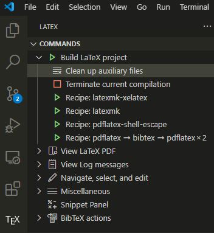

# LaTeX Template for Reports at University of Michigan

This template is adapted from [NIT - Trichy B.Tech Thesis Template](https://www.overleaf.com/latex/templates/nit-trichy-btech-thesis-template/cywtdmqjjmgr)
on Overleaf.

## Dependency

    - TeX Live
    - vscode (optional)
    - Linux (optional)

## Usage

1. All the contents of the report is included in *main.tex*. Replace anything you need in the *.tex* files and *.bib* files and figures in the *fig* directory.
   
    ```
    |-- main.tex
        |-- titlepage.tex
        |-- abstract.tex
        |-- Chapter1.tex
        |-- Chapter1.tex
        |-- Chapter1.tex
        |-- summary.tex
        |-- reference.bib
    ```

2. There are two ways to compile the full report.
    
    1. Use Linux command ["make"](https://www.gnu.org/software/make/#:~:text=Make%20is%20not%20limited%20to,or%20Makeinfo%20to%20format%20documentation.). "make" uses configurations specified in [*Makefile*](Makefile) and uses ["latexmk"](https://ctan.org/pkg/latexmk?lang=en) as automated LaTeX generator. 
       - If the name of the *main.tex* is unchanged, you can simply use following command in Linux
  
            ```
            make
            ```
       - Otherwise if the name of the *main.tex* is changed to *newname.tex* , you can use following command in Linux

            ```
            make doc FNAME=newname
            ```
    1. If you use "*latex-workshop*" extension in *vscode*, you can copy following settings to "*settings.json*". To be noted, there are two "*settings.json*" for *vscode*. One is for the global, called "User setting"; one is for current project, called "Workspace setting". More infomation about the settings in *vscode* can be found in ["Visual Studio Code settings"](https://code.visualstudio.com/docs/getstarted/settings).

        ```
        {
            "latex-workshop.latex.recipes": [
                {
                    "name": "latexmk-xelatex",
                    "tools": [
                        "latexmk-xelatex"
                    ]
                },
                {
                    "name": "latexmk",
                    "tools": [
                        "latexmk"
                    ]
                }
            ],
            "latex-workshop.latex.tools": [
                {
                    "name": "latexmk",
                    "command": "latexmk",
                    "args": [
                    "-synctex=1",
                    "-interaction=nonstopmode",
                    "-file-line-error",
                    "-pdf",
                    "%DOC%"
                    ]
                },
                {
                "name": "latexmk-xelatex",
                "command": "latexmk",
                "args": [
                    "-synctex=1",
                    "-interaction=nonstopmode",
                    "-file-line-error",
                    "-xelatex",
                    "-pdf",
                    "%DOC%"
                ]
                },
            ],
        }
        ```
    
        Then you will see two compiling buttons in the "*latex-workshop*" extension command tab.

        

        - The "*Recipe: latexmk-xelatex*" uses *xelatex" as LaTeX compiler, which can be used for compiling Chinese documents. 
        - The "*Recipe: latexmk*" uses *pdflatex" as LaTeX compiler, which can be used for compiling English documents. 
   